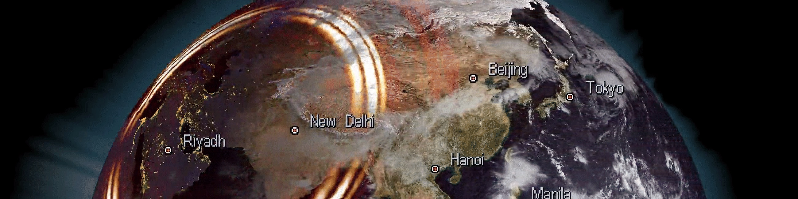

# SPECFEM

Hi, this is the **SPECFEM** github organization site to host a family of spectral-element code repositories. 

We are dedicated to open-source development for the computational seismology community. If you want to follow and participate in the discussions on this site, here is a quick [setup guide for you](../docs/specfem_discussions.pdf)

